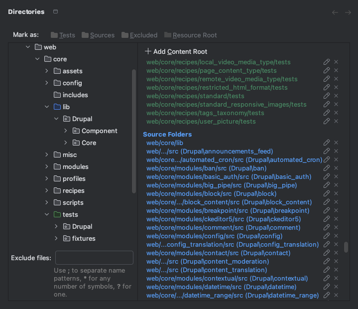

# Drupal Namespace Detector Plugin for PhpStorm

<!-- Plugin description -->

Drupal Namespace Detector is a PhpStorm plugin that detects sources/tests folders in Drupal core, modules, themes, or recipes and marks the directories as Source Roots or Test Roots.

If folder has a namespace, it will also be automatically registered as the package prefix.

 <!-- Remove from plugin description -->

The following folders can be detected.

- Drupal core: Sources and Tests
- Modules (core/contrib/custom): Sources and Tests
- Themes (core/contrib/custom): Tests only
- [Drupal Recipes](https://www.drupal.org/docs/extending-drupal/drupal-recipes): Tests only

## Supported Drupal Versions

Drupal 8 and later (including 9, 10, and 11)
<!-- Plugin description end -->

## Installation

- Using the IDE built-in plugin system:
  
  <kbd>Settings/Preferences</kbd> > <kbd>Plugins</kbd> > <kbd>Marketplace</kbd> > <kbd>Search for "Drupal Namespace Detector"</kbd> >
  <kbd>Install</kbd>
  
- Using JetBrains Marketplace:

  Go to [JetBrains Marketplace](https://plugins.jetbrains.com/plugin/10497-drupal-8-namespace-detector) and install it by clicking the <kbd>Install to ...</kbd> button in case your IDE is running.

  You can also download the [latest release](https://plugins.jetbrains.com/plugin/10497-drupal-8-namespace-detector/versions) from JetBrains Marketplace and install it manually using
  <kbd>Settings/Preferences</kbd> > <kbd>Plugins</kbd> > <kbd>⚙️</kbd> > <kbd>Install plugin from disk...</kbd>

- Manually:

  Download the [latest release](https://github.com/nmotod/idea-drupal8-namespace-detector/releases/latest) and install it manually using
  <kbd>Settings/Preferences</kbd> > <kbd>Plugins</kbd> > <kbd>⚙️</kbd> > <kbd>Install plugin from disk...</kbd>

## How to Use

1. Open your Drupal project in PhpStorm.
2. Choose <kbd>Code</kbd> > <kbd>Detect Drupal Namespace Roots</kbd> from the main menu
3. A notification balloon will appear when the detection is complete.

---
Plugin based on the [IntelliJ Platform Plugin Template][template].

[template]: https://github.com/JetBrains/intellij-platform-plugin-template
[docs:plugin-description]: https://plugins.jetbrains.com/docs/intellij/plugin-user-experience.html#plugin-description-and-presentation
